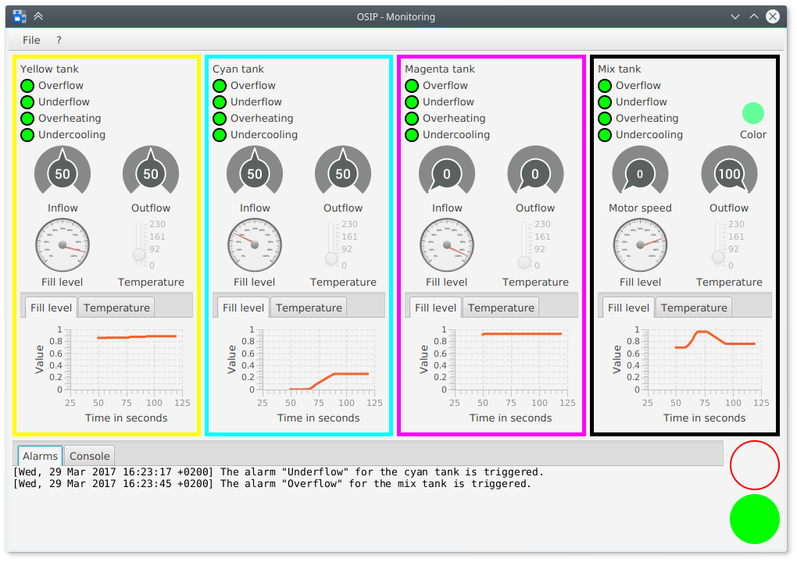

# OPC UA Simulator for Industrial Plants (OSIP)


OSIP ermöglicht es, die Vorteile der Vernetzung von Maschinen mit OPC UA interaktiv
zu demonstrieren, um Industriekunden von den neuen Möglichkeiten der Industrie 4.0 zu überzeugen.

Dieses Projekt entstand während der Praxis der Softwareentwicklung 2016/17 am Karlsruher Institut für Technologie
zum Thema *Implementierung eines OPC UA Systemadapters für den Industrial Data Space*.
Durchgeführt am Fraunhofer IOSB.

## Screenshots

Hauptfenster der Simulation:  


Hauptfenster der Überwachungskonsole:  


## Kompilieren

Das Projekt wird mit Maven verwaltet, der Build-Prozess ist somit weitestgehend automatisiert.
```bash
git clone https://github.com/ByteHamster/PSE.git
cd PSE/src
mvn package
```

Ein häufiges Problem ist, dass die Abhängigkeit `org.eclipse.milo` nicht gefunden werden kann. Dies liegt daran, dass alte Versionen von Milo aus dem Repository genommen werden. Das Problem kann behoben werden, indem die verwendete Version angepasst wird:

```xml
src/pom.xml:

<properties>
    <milo-version>0.1.2-SNAPSHOT</milo-version>
```

Die jeweils aktuelle Version kann im Repository herausgefunden werden:
https://oss.sonatype.org/content/repositories/snapshots/org/eclipse/milo/sdk-client/

## Ausführen

Simulation:
```bash
java -jar src/osip-simulation-controller/target/osip-simulation-controller-1.0-with-dependencies.jar
```

Überwachungskonsole:
```bash
java -jar src/osip-monitoring-controller/target/osip-monitoring-controller-1.0-with-dependencies.jar
```

## Beitragende

M. Armbruster ([@HansMartinA](https://github.com/HansMartinA))  
D. Kahles ([@Dav1dK](https://github.com/Dav1dK))  
H. Lehmann ([@ByteHamster](https://github.com/ByteHamster))  
M. Schwarzmann ([@marimbMax](https://github.com/marimbMax))  
N. Wilhelm ([@NikoWil](https://github.com/NikoWil))  
